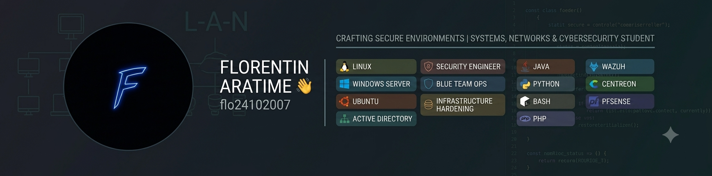

# Hi there, I'm Florentin ARATIME 👋

I am a Computer Science student specializing in system administration, networking, and cybersecurity. My ultimate career goal is to become a **Security Engineer**, with a strong focus on infrastructure hardening, network monitoring, and Blue Team operations.

---

### 🛠️ Technical Skills

**Systems & Virtualization**
*   **Linux:** Ubuntu (Desktop & Server), system administration, bash scripting.
*   **Windows Server:** Active Directory, network services, Samba 4 integration.
*   **Containers & Virt:** LXC deployment, multi-VM lab environments.

**Networking & Security**
*   **Monitoring & SIEM:** Centreon, Wazuh.
*   **Analysis & Auditing:** Wireshark, Nmap, Nessus.
*   **Routing & Firewalls:** pfSense deployment.

**Development**
*   **Languages:** Java, Bash, Python, PHP.

---

### 🚀 Key Projects

*   **Network Monitoring Lab**: Architected and deployed a multi-VM monitoring environment using Centreon to supervise Ubuntu Managers, Windows clients, and pfSense firewalls.
*   **Maritime Management Application**: Developed a Java-based desktop application utilizing JDBC for database connectivity and iTextPDF to handle automated ticket generation.

---

### 📊 GitHub Stats

---

### 📫 Connect with me

*   **LinkedIn:** https://www.linkedin.com/in/florentin-aratime-3249a039a?utm_source=share_via&utm_content=profile&utm_medium=member_android
*   **Email:** florat24@gmail.com.
